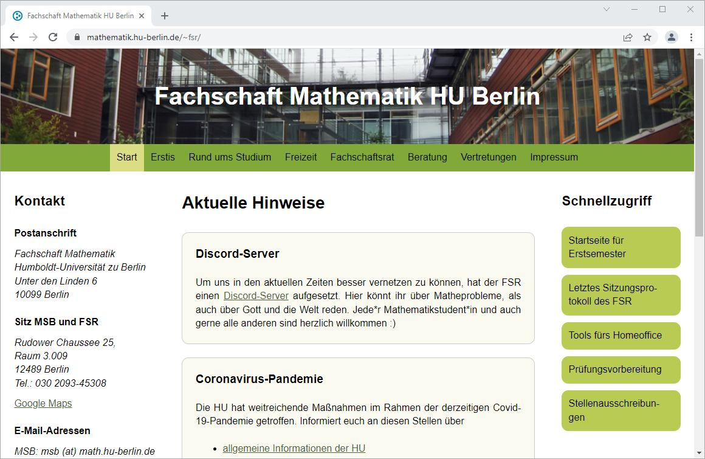
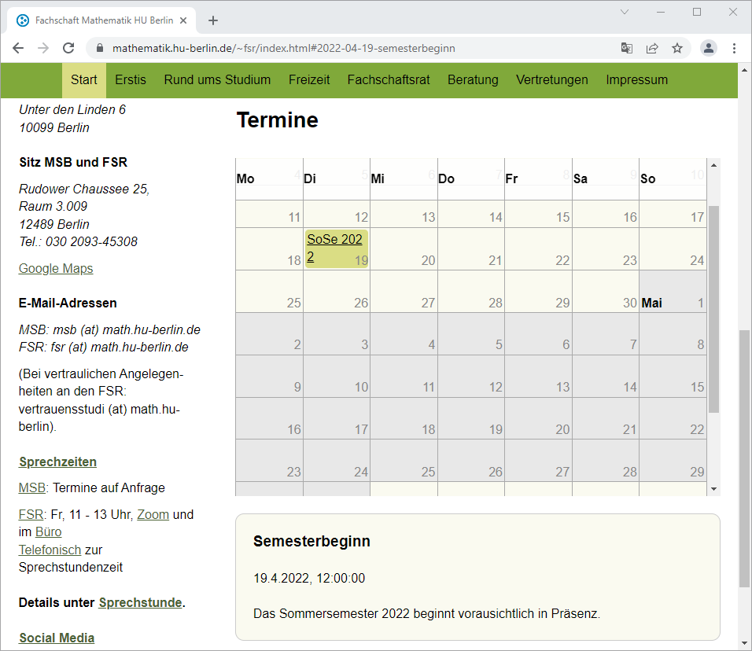

# fsr-website

fsr-website is the [website of the mathematical student association of the Humboldt University of Berlin](https://www.math.hu-berlin.de/~fsr/). Information on how to use administer the website can be found in [howtousethis.md](./howtousethis.md).

It uses the static site generator [Wintersmith](https://github.com/jnordberg/wintersmith) and looks something like this:

